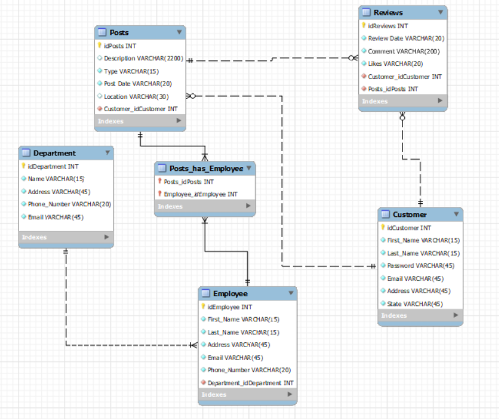

# Instagram Database (SQL)

This project models the back-end database of a simplified **Instagram-like system**.  
It demonstrates **data modeling, functional requirements documentation, and SQL querying** with entities such as **customers, employees, posts, reviews, and departments**.  

The repository includes:  
- Requirements documentation (**FRD** + **Data Dictionary**)  
- Design artifacts (**ERD**, `.mwb` schema, Excel tables)  
- Executable **SQL queries**  

---

## Repository Structure
```
instagram-database/
│
├── Requirements/
│ ├── FRD.docx # Functional Requirements Document
│ ├── Data_Dictionary.docx # Attributes, constraints, PK/FK definitions
│
├── Design/
│ ├── Instagram.mwb # MySQL Workbench ERD model
│ ├── Tables.xlsx # Excel representation of entities
│ └── ERD.png # Exported ERD diagram
│
├── Queries/
│ ├── scripts.sql # SQL script to create all tables
│ └── scripts.png # Example of scripts running
│
└── README.md # Project overview
```
---

## Functional Requirements

The **Functional Requirements Document (FRD)** defines the project’s purpose, scope, and methodology:

### Purpose  
Document requirements and build an ERD/SQL system for Instagram-like data.  

### Scope  
Identify entities (**Customer, Employee, Department, Posts, Reviews**) and define relationships.  

### Background  
Instagram, with over **2.3B monthly users**, is a platform for photo and video sharing.  

### Constraints  
Project deadlines dictated by class submission requirements.  

### Methodology  
Translate requirements into entities, attributes, and relationships using ERD modeling, then implement with SQL.  

The **Data Dictionary** complements this by listing attributes, data types, nullability, and PK/FK constraints.  

---

## ERD (Entity Relationship Diagram)



The schema demonstrates:  
- **One-to-many** → Customer → Posts, Posts → Reviews  
- **Many-to-many** → Employees ↔ Posts (via `Posts_has_Employee`)  
- **Hierarchical** → Employees organized by Department  

---

## Example Queries

All SQL queries are stored in the [`Scripts/`](Scripts) folder.  


